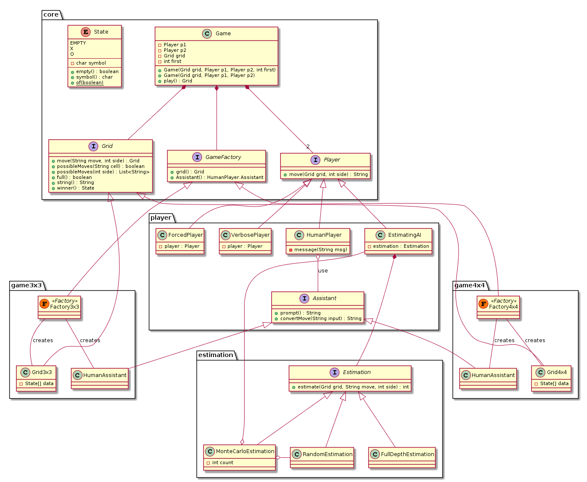

# elegant-tictactoe

Object-Oriented realization of [Tic-Tac-Toe](https://en.wikipedia.org/wiki/Tic-tac-toe) board game. 
Inspyred by [Yegor256](http://www.yegor256.com/elegant-objects.html)'s Elegant Objects conception.

The class diagram of the project:

